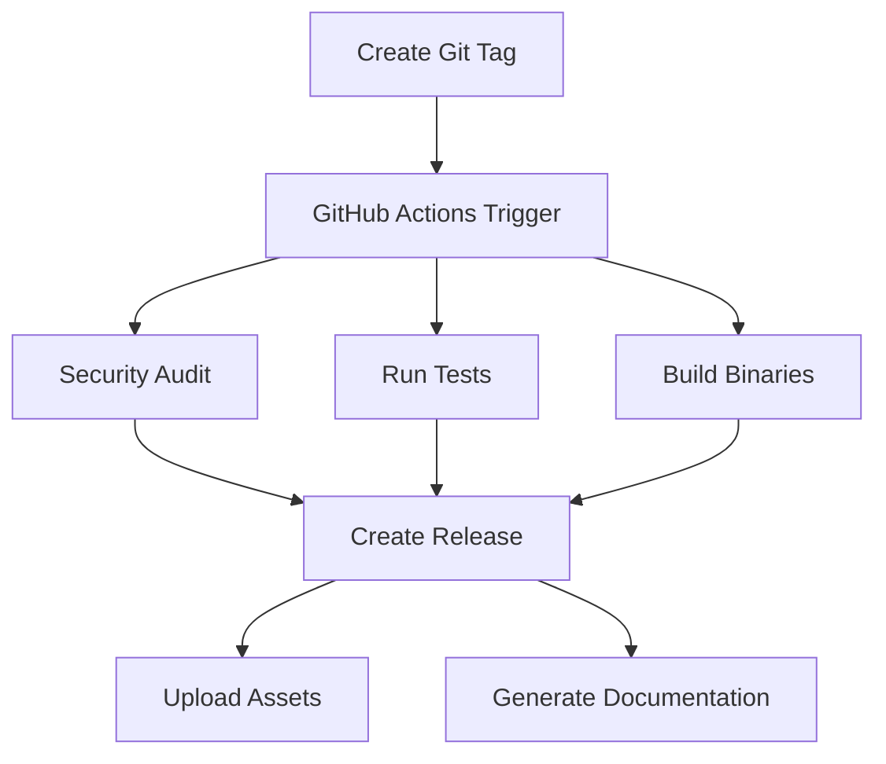

# rfgrep Release and Versioning Guide

This guide explains how to manage releases and versioning for rfgrep using our automated CI/CD pipeline.

## 🚀 **Automated Release Process**

### **Overview**

We have set up a comprehensive automated release system that includes:

- **GitHub Actions CI/CD**: Automated testing, building, and releasing
- **Security Auditing**: Automated vulnerability scanning
- **Multi-platform Support**: Linux, Windows, macOS builds
- **Automated Documentation**: Man pages and shell completions
- **Dependency Management**: Automated updates with Dependabot

### **Release Workflow**



## 📋 **Release Checklist**

### **Pre-Release (Manual)**

- [ ] **Update CHANGELOG.md** with new features and fixes
- [ ] **Update version** in `Cargo.toml`
- [ ] **Update man pages** with new version
- [ ] **Test locally** with `./scripts/release.sh -t`
- [ ] **Review changes** and ensure all tests pass
- [ ] **Commit all changes** to main branch

### **Release (Automated)**

- [ ] **Create git tag**: `git tag -a v0.2.0 -m "Release v0.2.0"`
- [ ] **Push tag**: `git push origin v0.2.0`
- [ ] **Monitor GitHub Actions** for automated release
- [ ] **Review release** on GitHub
- [ ] **Update external documentation** if needed

## 🔧 **Release Commands**

### **Using the Release Script**

```bash
# Test only (recommended before release)
./scripts/release.sh -t

# Dry run (simulate release without changes)
./scripts/release.sh -d v0.2.0

# Full release process
./scripts/release.sh v0.2.0

# Create package only
./scripts/release.sh -p v0.2.0
```

### **Manual Release Process**

```bash
# 1. Update version in Cargo.toml
sed -i 's/version = "0.1.0"/version = "0.2.0"/' Cargo.toml

# 2. Update man pages
find man -name "*.1" -exec sed -i 's/rfgrep 0.1.0/rfgrep 0.2.0/g' {} \;

# 3. Test everything
cargo test --all-features --workspace
cargo clippy --all-targets --all-features -- -D warnings
cargo fmt --all -- --check

# 4. Build release
cargo build --release

# 5. Test man pages and completions
./test_man_pages.sh
./test_completions.sh

# 6. Commit changes
git add .
git commit -m "chore: bump version to v0.2.0"

# 7. Create tag
git tag -a v0.2.0 -m "Release v0.2.0"

# 8. Push to trigger automated release
git push origin main
git push origin v0.2.0
```

## 🏷️ **Versioning Strategy**

### **Semantic Versioning**

We follow [Semantic Versioning](https://semver.org/) (SemVer):

- **MAJOR.MINOR.PATCH** (e.g., `0.2.0`)
- **MAJOR**: Breaking changes
- **MINOR**: New features (backward compatible)
- **PATCH**: Bug fixes (backward compatible)

### **Version History**

| Version | Date | Changes |
|---------|------|---------|
| `v0.1.0` | Initial release | Basic functionality |
| `v0.2.0` | Current | Major feature release |

### **Next Release Planning**

- **v0.3.0**: Interactive mode integration
- **v0.4.0**: Advanced search algorithms
- **v1.0.0**: Production-ready release

## 🔄 **CI/CD Pipeline**

### **GitHub Actions Workflows**

#### **1. CI Workflow** (`.github/workflows/ci.yml`)

**Triggers**: Push to main, Pull requests

**Jobs**:
- **Security Audit**: `cargo audit` for vulnerabilities
- **Test Suite**: Comprehensive testing
- **Build**: Release binary compilation
- **Documentation**: Generate docs
- **Security Scan**: Trivy vulnerability scanner

#### **2. Release Workflow** (`.github/workflows/release.yml`)

**Triggers**: Git tags (`v*`)

**Jobs**:
- **Security Audit**: Pre-release security check
- **Test Suite**: Full test suite
- **Build**: Multi-platform builds
- **Release**: Automated GitHub release
- **Documentation**: Release documentation
- **Security Scan**: Post-release security check

### **Automated Features**

- ✅ **Multi-platform builds** (Linux, Windows, macOS)
- ✅ **Security auditing** with cargo-audit
- ✅ **Vulnerability scanning** with Trivy
- ✅ **Automated testing** on every commit
- ✅ **Code quality checks** (clippy, fmt)
- ✅ **Documentation generation**
- ✅ **Release asset creation**
- ✅ **Checksum generation**

## 🔒 **Security Features**

### **Automated Security Checks**

1. **Dependency Auditing**: `cargo audit`
2. **Vulnerability Scanning**: Trivy scanner
3. **Code Quality**: Clippy with strict warnings
4. **Format Checking**: `cargo fmt`

### **Security Workflow**

```bash
# Manual security check
cargo audit --deny warnings

# Check for vulnerabilities
cargo audit --json

# Run clippy with strict warnings
cargo clippy --all-targets --all-features -- -D warnings
```

## 📦 **Release Assets**

### **Automatically Generated**

- **Binary**: `rfgrep` (Linux, Windows, macOS)
- **Man Pages**: Complete documentation
- **Shell Completions**: Bash, Zsh, Fish, PowerShell, Elvish
- **Checksums**: SHA256 for integrity verification
- **Documentation**: Installation guide, changelog

### **Release Package Structure**

```
rfgrep-v0.2.0-linux-x86_64.tar.gz
├── rfgrep (binary)
├── man/ (man pages)
├── *.md (documentation)
├── *.sh (test scripts)
└── checksums.txt
```

## 🔄 **Dependency Management**

### **Dependabot Configuration**

Automated dependency updates via `.github/dependabot.yml`:

- **Weekly updates** for Rust dependencies
- **Weekly updates** for GitHub Actions
- **Automated PR creation** for updates
- **Security-focused** updates prioritized

### **Manual Dependency Updates**

```bash
# Update dependencies
cargo update

# Check for outdated dependencies
cargo outdated

# Update specific dependency
cargo update -p dependency-name
```

## 🐛 **Troubleshooting**

### **Common Issues**

#### **1. CI Fails on Security Audit**

```bash
# Check for vulnerabilities
cargo audit

# Update dependencies
cargo update

# Check specific vulnerability
cargo audit --id VULNERABILITY-ID
```

#### **2. Release Fails**

```bash
# Check git status
git status

# Ensure clean working directory
git stash  # if needed

# Verify tag format
git tag -l

# Check remote configuration
git remote -v
```

#### **3. Build Fails**

```bash
# Clean and rebuild
cargo clean
cargo build --release

# Check Rust version
rustc --version

# Update Rust toolchain
rustup update
```

### **Debug Commands**

```bash
# Test release script
./scripts/release.sh -t

# Dry run release
./scripts/release.sh -d v0.2.0

# Check CI locally
cargo test --all-features --workspace
cargo clippy --all-targets --all-features -- -D warnings
cargo fmt --all -- --check

# Test man pages
./test_man_pages.sh

# Test completions
./test_completions.sh
```

## 📚 **Best Practices**

### **Release Preparation**

1. **Plan the release** with clear changelog
2. **Test thoroughly** before tagging
3. **Update documentation** with new features
4. **Review security** with cargo-audit
5. **Check formatting** with cargo fmt

### **Version Management**

1. **Follow SemVer** strictly
2. **Update all version references**
3. **Test with new version**
4. **Document breaking changes**
5. **Update migration guides**

### **Quality Assurance**

1. **Run full test suite**
2. **Check code quality** with clippy
3. **Verify formatting** with cargo fmt
4. **Test man pages** and completions
5. **Security audit** with cargo audit

## 🎯 **Next Steps**

### **Immediate Actions**

1. **Push current changes** to GitHub
2. **Enable Dependabot** in repository settings
3. **Review security settings** in repository
4. **Test the release workflow** with a patch release
5. **Document the process** for contributors

### **Future Enhancements**

- **Automated changelog generation**
- **Release notes automation**
- **Docker image builds**
- **Package manager releases** (Homebrew, AUR)
- **Performance benchmarking**
- **Code coverage reporting**

---

**This guide ensures consistent, secure, and automated releases for rfgrep!** 🚀 